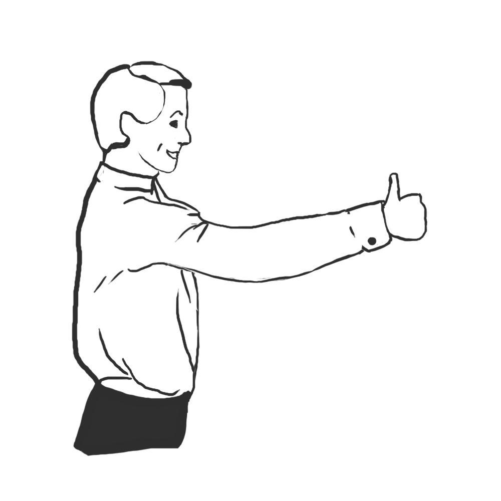
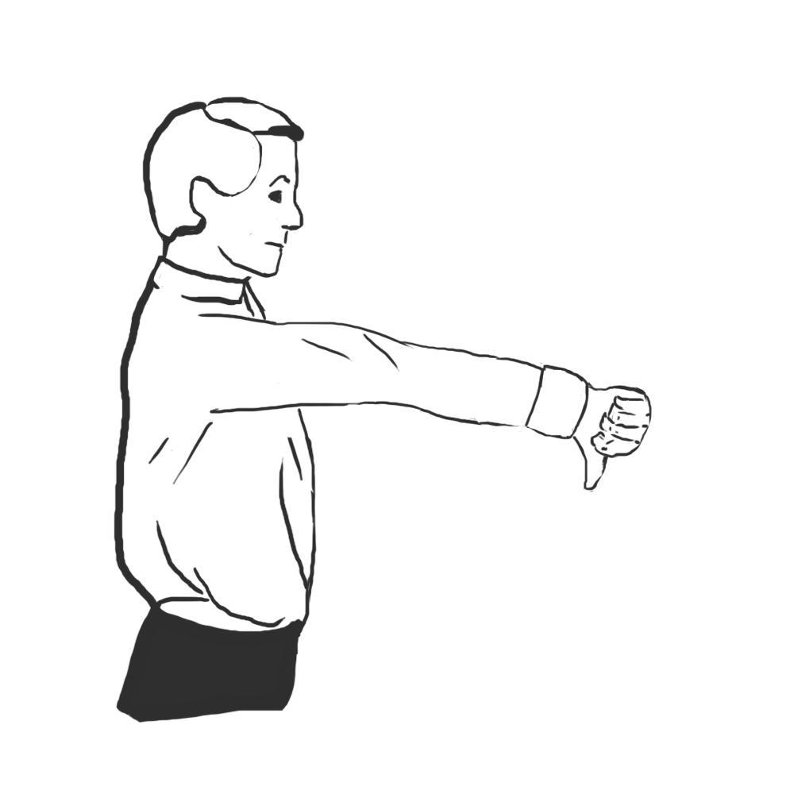
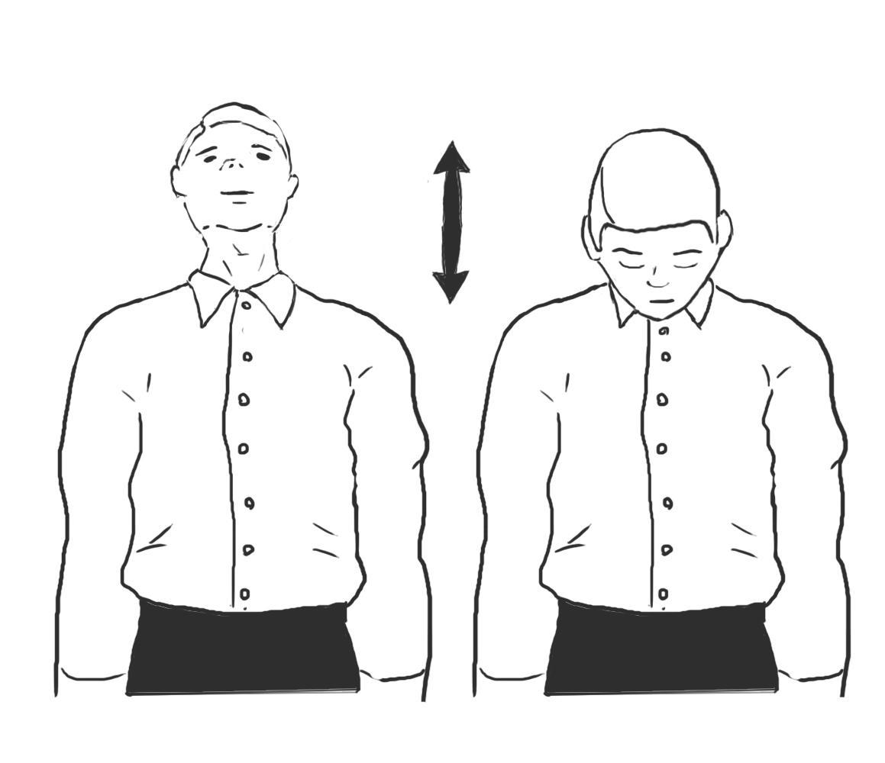
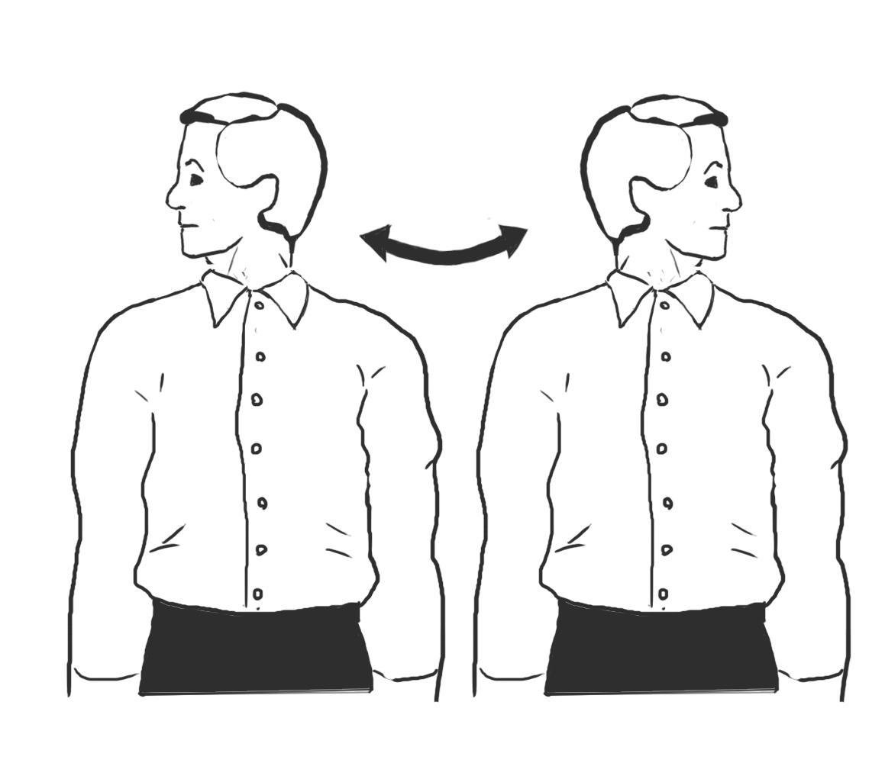

# ОФИЦИАЛЬНЫЕ ПРАВИЛА ИГРЫ «МАФИЯ»

**Редакция от 6 января 2023 г.**

## 1. Основные понятия

- В игре принимают участие десять человек. Игроки случайным образом делятся на две команды: "красные" (мирные жители) и "чёрные" (мафия). В игре разыгрываются 7 "красных" карт, одна из которых — Шериф, и 3 "чёрные", одна из которых — Дон.
- Ведёт игру, регламентирует её начало, конец и все игровые фазы Судья. Ведению игры могут помогать боковые Судьи.
- Игра имеет две фазы: фаза "день" и фаза "ночь".
- Победа команды "красных" наступает в тот момент, когда из игры выведены все представители "чёрной" команды. Победа "чёрной" команды наступает в случае, когда за игровым столом остаётся равное количество игроков обеих команд или количество "черных" игроков больше, чем "красных". Моментом вывода игрока является момент голосования или ночного "убийства".

## 2. Игровая площадка, инвентарь и официальный язык игры

- Игровой стол должен быть таким, чтобы за ним комфортно разместились 10 игроков. Судья имеет право разместиться за игровым столом или рядом с игровым столом так, чтобы иметь возможность видеть и слышать всё, что происходит за игровым столом.
- У каждого игрового бокса должна быть табличка с номером и игровая маска для игрока.
- Игровая площадка должна быть обеспечена акустикой или иным музыкальным оборудованием для проведения игровой "ночи".
- Официальным языком игры является русский язык.

## 3. Игроки

- Игрок находится на игровой площадке до тех пор, пока принимает участие в игровом процессе.
- Игрок может использовать экипировку, которая не создаёт опасность для других игроков, не оскорбляет игроков, судей или зрителей и не может создать незаслуженное преимущество над другими игроками.
- По требованию Судьи игроки должны сдать перед игрой все мобильные устройства, переведя их перед этим в беззвучный режим или выключив.
- Использование собственных масок во время игры допускается только с разрешения Судьи стола.

## 4. Игровые положения

### 4.1. Начало игры

- За игровой стол приглашаются десять игроков. Место за игровым столом разыгрывается случайным образом судьёй стола непосредственно перед началом игры, либо указано в расписании.
- Судья представляет игроков и объявляет начало игры фразой "наступает ночь". Все игроки надевают игровые маски.
- Игроки по очереди с закрытыми глазами выбирают игровую карту, снимают маску, знакомятся с игровой ролью и надевают маску, низко наклоняют головы и, при необходимости, по команде судьи, закрывают уши руками.

### 4.2. Первая игровая "ночь"

- По объявлению Судьи игроки, получившие "чёрные" карты, снимают маски, знакомятся друг с другом. Это единственная ночь, когда "чёрные" игроки открывают глаза вместе. Дон жестом показывает, что он является Доном, и назначает порядок "отстрела" на последующие "ночи". На это у "чёрной" команды есть ровно 1 минута. После этого по объявлению Судьи "чёрные" игроки надевают маски и "засыпают".
- В последующие ночи Дон будет "просыпаться", чтобы найти Шерифа игры. На проверку Дон имеет не более 10-ти секунд.
- По объявлению Судьи Шериф может снять маску и осмотреть игроков, на это он имеет не более 20-ти секунд. В последующие ночи Шериф будет "просыпаться" ночью и проверять игроков на принадлежность к той или иной команде. На проверку Шериф имеет не более 10-ти секунд.

### 4.3. Игровой "день"

- Судья объявляет игровую фазу Дня. Игроки снимают маски. В эту фазу происходит обсуждение. В каждый игровой день игроку предоставляется 1 минута для высказывания и выставления кандидатур на голосование.
- Игроки высказываются по очереди в порядке рассадки за игровым столом. Обсуждение первого игрового дня начинает игрок под номером 1. Обсуждение каждого последующего игрового дня начинается со следующего после говорившего первым на предыдущем кругу игрока.
- Игрок имеет право обращаться к другим игрокам по игровому никнейму или порядковому номеру игрока.
- Игрок имеет право обращаться к Судье фразой "Господин (-жа) Судья" или "Господин (-жа) Ведущий (-ая)".
- Игроки заканчивают свое выступление словом "ПАС" или словом "СПАСИБО".
- Игроки не имеют права надевать маску на глаза в фазе игрового дня.

### 4.4. Голосование

- По окончании "дневного" обсуждения происходит голосование. Голосование проводится только среди игроков, выставленных на голосование во время "дневного" обсуждения.
- Во время своей минуты игрок имеет право выставить любого игрока на голосование. Выставление игрока на голосование производится фразой в настоящем времени: "Я выставляю игрока № …". В ответ Судья, если данная кандидатура принимается, произносит фразу: "Принято".
- Игрок имеет право выставить на голосование только одну кандидатуру в каждый игровой "день".
- Игроки голосуются в том порядке, в котором они были выставлены на голосование во время "дневного" обсуждения.
- Для того, чтобы проголосовать против того или иного игрока, игрок обязан после озвучивания кандидатуры незамедлительно поставить кулак в вертикальном положении на игровой стол до того момента, пока Судья не скажет: "Стоп" или "Спасибо". Время на голосование — около 1,5 секунды.
- Игрок обязан держать руку на поверхности игрового стола до тех пор, пока Судья не объявит количество проголосовавших.
- Игрок имеет право голосовать только против одного кандидата во время голосования.
- Если игрок не проголосовал, то его голос отходит против игрока, выставленного на голосование последним.
- Если игрок отдернул руку при голосовании, то его голос засчитывается.
- Если в первый игровой "день" выставлена только одна кандидатура, то голосование не проводится. В течение следующих "дней" голосуется любое количество выставленных на голосование игроков.
- Игрок, набравший большинство голосов на дневном голосовании, покидает игру.
- Если два или более игроков набирают одинаковое количество голосов на голосовании, то эти игроки получают дополнительные 30 секунд на высказывание, после чего среди них проводится повторное голосование.
- Высказывание игроков и повторное голосование проходят в порядке их выставления.
- Если при повторном голосовании голоса снова поделились поровну, но среди меньшего количества кандидатур, то игроки, поделившие между собой спорные голоса, снова получают дополнительные 30 секунд на высказывание, после чего среди них проводится повторное голосование.
- Если при повторном голосовании голоса снова поделились поровну среди тех же самых кандидатур, то Судьёй ставится на голосование вопрос: "Кто за то, чтоб все голосуемые игроки покинули игровой стол?". Если большинство голосует за выбывание, игроки покидают игру. Если большинство игроков голосует против, либо голоса делятся поровну, то игроки остаются в игре.
- Роль покинувшего игру игрока не раскрывается. Покинувший игру игрок имеет право на последнее слово продолжительностью в 1 минуту.

### 4.5. Вторая и последующие "ночи"

- По окончании первого игрового "дня" Судья объявляет: "Наступает ночь". Все игроки незамедлительно надевают игровые маски.
- В течение этой и следующих "ночей" мафия имеет возможность "стрелять".
- Судья объявляет: "Мафия выходит на охоту". Далее Судья каждую ночь объявляет номера игроков от 1 до 10. Игроки "чёрной" команды "стреляют" с закрытыми глазами посредством имитации выстрела пальцами высоко поднятой руки.
- Если игроки "чёрной" команды "стреляют" в одного и того же игрока, то этот игрок по истечении "ночи" покидает игровой стол. Роль покинувшего игру игрока не раскрывается. Покинувший игру игрок имеет право на последнее слово продолжительностью в 1 минуту.
- Если кто-то из членов "чёрной" команды "стреляет" в другого игрока, "стреляет" в нескольких игроков или не "стреляет", то Судья фиксирует промах, и по итогам "ночи" игровой стол никто не покидает. Далее Судья объявляет: "Мафия удаляется".
- Судья объявляет: "Просыпается Дон и ищет Шерифа". Дон снимает игровую маску и показывает пальцами рук Судье номер игрока, которого он считает Шерифом. Судья характерным кивком головы подтверждает его версию, либо отрицает. Судья объявляет: "Дон засыпает". Дон надевает игровую маску.
- Судья объявляет: "Просыпается Шериф". Шериф снимает игровую маску и показывает пальцами рук Судье номер игрока, которого он хочет проверить на принадлежность к той или иной команде. В случае нахождения "красного" игрока, судья характерным поворотом головы и вытянутым вверх большим пальцем руки показывает игроку результат проверки. В случае нахождения "чёрного" игрока, судья показывает результат проверки характерным кивком головы и вытянутым вниз большим пальцем руки. Судья объявляет: "Шериф засыпает". Шериф надевает игровую маску.
- Дон и Шериф имеют право на одну проверку каждую игровую "ночь".
- Игрок, "убитый" во вторую игровую "ночь" (первую ночь после "договорки"), имеет право во время "ночи" сделать "лучший ход", если иное не предусмотрено Правилами. Судья объявляет: "Игрок №, вас убили. Проснитесь". Игрок, к которому обратился Судья, снимает маску и озвучивает вслух номера трёх игроков, которых он считает "чёрными". На раздумья игрок имеет не более 20-ти секунд. После завершения "лучшего хода" судья объявляет «Принято» и игрок снова засыпает. После чего Судья объявляет "утро" и предоставляет "убитому" игроку заключительную минуту.
- В игровую "ночь" игроки должны вести себя в рамках "ночного" поведения и сидеть в соответствующей "ночной" позе — спина ровная, руки перекрещены и лежат на плечах, голова слегка наклонена вперёд примерно на 45 градусов от вертикального положения.
- Во время "ночи" запрещено петь, танцевать, говорить, прикасаться к другим игрокам, есть или пить, курить, совершать иные действия, выходящие за рамки "ночного" поведения.
- Игровая маска должна быть надета на резинку и плотно закрывать глаза, не создавая при этом просвета по периметру вокруг глаз. Не допускается использование маски, не подходящей по размеру. Держать маску руками или дополнительно прижимать её к лицу запрещено.
- Перед наступлением "ночи" игроки должны снять в себя любые головные уборы (шляпы, кепки, капюшоны и т.п.), очки в случае их наличия, светоотражающие предметы (часы, браслеты и т.п.).

### 4.6. Дальнейший ход игры

В последующие "дни" и "ночи" ход игры не меняется, фазы игры чередуются до победы той или иной команды.

## 5. Нарушения

Нарушениями правил считаются:

- использование клятвы и/или пари в любой форме, а также их аналогов с целью доказывания своей роли и/или влияния на ход игры;
- использование шантажа, угроз и/или подкупа с целью влияния на ход игры;
- доказывание игроком, "вскрывшимся" шерифом, своей роли с помощью уникальной "ночной" информации (действия игроков или события, которые можно было увидеть во время "проверки");
- сознательное подглядывание для получения информации, иные неигровые способы получения информации;
- подсказки из зрительного зала;
- нанесение оскорблений другим игрокам, Судьям или зрителям;
- "ночные" подсказки знаками Дону и Шерифу;
- непроизвольное подглядывание "ночью";
- "ночные" прикосновения;
- "ночные" разговоры или выкрики, иные нарушения правил ночного поведения;
- покидание игрового стола;
- апеллирование к неигровым этическим и/или религиозным ценностям или иные "неигровые апелляции" с целью доказывания своей роли прямым или косвенным образом или влияния на исход голосования ("честное слово, я красный", "видит Бог, я красный", "умоляю тебя, проголосуй со мной, я шериф" и т.д.);
- стуки по игровому столу, неэтичное поведение по отношению к другим игрокам и Судьям, споры с Судьёй;
- "дневные" прикосновения, использование излишней жестикуляции;
- речь не в свою игровую минуту, в том числе междометия, шёпот и понятная артикуляция;
- отдергивание руки при голосовании до подведения итогов голосования (слова Судьи "Стоп" или "Спасибо");
- жестикуляция и призывы во время фазы голосования;
- слёзы за игровым столом;
- нарушение установленного порядка голосования (голосование против нескольких кандидатур, неголосование в случае, когда Судья требует поставить оставшиеся голоса против последней кандидатуры и т.п.);
- нарушение установленной формы голосования (голосование ладонью, пальцем, локтем и т.п.);
- просьба назвать или не называть кого-либо в "лучший ход", выраженная вслух или с помощью жестикуляции;
- апеллирование к влиянию на "лучший ход" с целью доказывания игровой роли или объяснения игровых действий;
- попытка передачи уникальной дневной информации с помощью шёпота, явно скрываемого от судей и большинства игроков (т.е. совершаемого строго на ухо сидящему рядом игроку, чтобы никто не услышал);
- использование мата, нецензурной лексики.

## 6. Дисциплинарный регламент

- Нарушения правил фиксируются Судьёй.
- Игроки, нарушившие правила, наказываются Судьёй игры или Главным Судьёй в соответствии с регламентом.
- Игрок может быть устно предупреждён, наказан фолом, дисквалифицирован с игры или турнира, а также команде игрока, совершившего нарушение, может быть присуждено поражение.
- При получении трёх фолов игрок лишается права слова в свою ближайшую минуту, при этом у игрока остаётся право выставить кандидатуру на голосование.
- При получении четвёртого фола или дисквалифицирующего фола игрок немедленно покидает игру без последнего слова.

### 6.7. Фолы

Игроки во время игры получают фол за следующие нарушения:

- речь не в свою игровую минуту, в том числе междометия, шёпот и понятная артикуляция;
- использование излишней жестикуляции;
- "дневные" прикосновения;
- стуки по игровому столу, неэтичное поведение по отношению к другим игрокам и Судьям;
- споры с Судьёй;
- отдёргивание руки при голосовании до подведения итогов голосования (слова Судьи "Стоп" или "Спасибо"), постановка руки на стол до голосования;
- жестикуляция и призывы во время фазы голосования;
- нарушение установленного порядка голосования (голосование против нескольких кандидатур, неголосование в случае, когда Судья требует поставить оставшиеся голоса против последней кандидатуры и т.п.).

### 6.8. Дисквалифицирующий фол (удаление игрока)

Игрок дисквалифицируется с игрового стола за следующие нарушения:

- покидание игрового стола;
- "ночные" прикосновения;
- "ночные" подсказки знаками Дону и Шерифу;
- нанесение оскорблений другим игрокам, Судьям или зрителям;
- непроизвольное подглядывание "ночью";
- "ночные" разговоры или выкрики, иные нарушения правил ночного поведения;
- слёзы за игровым столом;
- апеллирование к неигровым этическим и/или религиозным ценностям или иные "неигровые апелляции" с целью доказывания своей роли прямым или косвенным образом или влияния на исход голосования ("честное слово, я красный", "видит Бог, я красный", "умоляю тебя, проголосуй со мной, я шериф" и т.д.);
- нарушение установленной формы голосования (голосование ладонью, пальцем, локтем и т.п.);
- сознательное подглядывание для получения информации, иные неигровые способы получения информации;
- просьба назвать или не называть кого-либо в "лучший ход", выраженная вслух или с помощью жестикуляции;
- апеллирование к влиянию на "лучший ход" с целью доказывания игровой роли или объяснения игровых действий;
- попытка передачи уникальной дневной информации с помощью шёпота, явно скрываемого от судей и большинства игроков (т.е. совершаемого строго на ухо сидящему рядом игроку, чтобы никто не услышал);
- сокрытие речевой информации путём её озвучивания на иностранном языке;
- использование мата, нецензурной лексики.

### 6.9. Присуждение поражения команде

Игрок получает штраф за дисквалификацию и его команде присуждается поражение за следующие нарушения:

- использование клятвы и/или пари в любой форме, а также их аналогов с целью доказывания своей роли и/или влияния на ход игры;
- использование шантажа, угроз и/или подкупа с целью влияния на ход игры;
- подсказки из зрительного зала;
- доказывание игроком, "вскрывшимся" шерифом, своей роли с помощью уникальной "ночной" информации (действия игроков или события, которые можно было увидеть во время "проверки");
- совершение нарушения по любому из пунктов 6.7.4, 6.7.7, 6.7.8, 6.7.12, 6.7.13, 6.7.14 игроком во время его заключительной минуты или после того, как он стал покидающим игру по результату голосования.

После того, как в игре состоялось решающее "убийство" или "голосование", по результату которого был определён результат игры, наказания по пунктам 6.7.2 – 6.7.3, 6.7.5 – 6.7.14, 6.8.1. – 6.8.5 не применяются.

## 7. Особые ситуации

- Если игрок покидает игровой стол, получая 4-й или дисквалифицирующий фол, то ближайшее или текущее голосование не проводится, кроме случаев, когда этот игрок был убит ночью или является покинувшим игру по результату голосования.
- Если игрок покидает игровой стол, получая 4-й или дисквалифицирующий фол после того, как стал известен результат голосования текущего дня, и он не является покидающим игру в результате этого голосования, то голосование на следующий день не проводится. Если голосование в этот день не проводится, то моментом определения его результата является объявление "ночи".
- За сознательное подглядывание для получения информации, иные неигровые способы получения информации, а также за оскорбление Судьи или Главного Судьи игрок удаляется с турнира.
- Игрок не имеет права получать у Судьи информацию о выставленных на голосование игроках.
- Если игрок получил 3-й фол и попал в ситуацию переголосования, то он имеет право слова.
- Если игрок набрал 3 фола, и к моменту его ближайшей речи до голосования за столом осталось 3 или 4 игрока, то он имеет 30 секунд.
- Если в игре прошло три "ночи" подряд и за этот период количество участников игры осталось неизменным, то после третьей "ночи" присуждается ничья.
- Голосование за подъем всех игроков, находящихся за столом, не проводится.
- При наступлении победы одной из команд в результате решающего голосования или "убийства", уходящий игрок всегда имеет право на последнее слово продолжительностью в одну минуту. В случае дисквалификации любого игрока результат игры не меняется, а дисквалифицированный игрок получает штраф в соответствие с пунктом 8.2.4.
- Игрок, "убитый" в первую ночь, не имеет права на "лучший ход", если по результату голосования в первый день игру покинули 2 или большее количество игроков.

## 8. Регламент проведения турниров

### 8.1. Балловая система

На турнире применяется балловая система оценок.

### 8.2. Начисление очков рейтинга

По результатам каждой игры участникам автоматически начисляются очки рейтинга:

- за победу каждый игрок "красной" команды получает 1 балл;
- за победу каждый игрок "чёрной" команды получает 1 балл;
- за поражение или ничью игроки не получают рейтинговых баллов или штрафов;
- при дисквалификации с игрового стола игрок получает штраф -0,5 баллов в свой итоговый рейтинг;
- Игрок, который совершил ППК, получает штраф -0,7 баллов в свой итоговый рейтинг.

### 8.3. "Лучший ход"

- Игрок, "убитый" вторую игровую ночь (первую ночь после "договорки"), имеет право во время "ночи" сделать "лучший ход" — назвать номера трёх игроков, которых он считает "чёрными".
- Совершение "лучшего хода" может сопровождаться дополнительным устным объявлением (например, фразой "Запишите тройку чёрных"), после чего игрок должен назвать три номера друг за другом, которые должны быть внесены в Протокол игры. В ответ Судья озвучивает принятые им кандидатуры и произносит фразу: "Принято".
- В случаях, если игрок озвучил какую-либо игровую информацию, обратился к кому-либо из игроков или допустил высказывания, провоцирующие других игроков на реакцию, это засчитывается как завершение "лучшего хода". Судья принимает только то количество номеров, которые игрок успел назвать к этому моменту.
- Изменение названных номеров в "лучшем ходе", а также добавление неназванных номеров не производится.
- За трёх названных "чёрных" игроков "красный" игрок и "шериф" получает +0,5 дополнительных баллов; за двух названных "чёрных" игроков "красный" игрок и "шериф" получают +0,3 дополнительных баллов.
- Игрок не имеет права на "лучший ход", если по результату голосования в первый игровой день игру покинули 2 или большее количество игроков.

### 8.4. Дополнительные баллы от Судьи

По окончании игры Судья или Судьи игры имеют право распределить дополнительные баллы между лучшими игроками игры.

- Судья может вознаградить дополнительными баллами до пяти игроков, при этом вознаграждение более четырёх игроков допускается только по согласованию с Главным Судьей.
- Общая сумма дополнительных баллов от Судьи не должна превышать 1,8 балла и 2 балла по согласованию с Главным Судьёй.
- Игрок из победившей команды может получить от Судьи +0,3; +0,4; +0,5; +0,6 или +0,7; +0,8 балла, при этом получение игроком дополнительных баллов величиной +0,7 или +0,8 за одну игру допускается только по согласованию с Главным Судьёй.
- Игрок из проигравшей команды может получить от Судьи +0,2; +0,3; +0,4 или +0,5 балла.
- Судья не обязан давать игрокам максимальное кол-во дополнительных баллов. Дополнительные баллы распределяются между игроками независимо от победы той или иной команды.
- Дополнительные баллы от Судьи и баллы, полученные игроком за двух или трёх названных "чёрных" игроков в "лучшем ходе", являются взаимоисключающими величинами. При наличии и того, и другого игрок получает в итоговый рейтинг наибольшую из этих двух величин, при этом в случае, если этой величиной являются дополнительные баллы от Судьи, то они учитываются в общем лимите дополнительных баллов согласно пункту 8.4.2.
- В случае присуждения ничьей игроки не получают дополнительные баллы от Судьи.
- Все игроки победившей и проигравшей команды, которые не совершали деструктивных действий, получают автоматический доп 0.3 балла. Если игрок был дисквалифицирован, получил штраф или его действия привели к ППК, он не получают автоматический доп. Автоматический доп суммируется с доп. баллами от судьи и не влияет на них никак.

При получении доп. баллов игрок обязательно получает автоматический доп.

### 8.5. Штрафные баллы

По окончании игры Судья или Судьи игры должны присудить игрокам штрафные баллы в размере -0.4 балла за действия, негативно повлиявшие на ход игры, при этом эти баллы считаются дополнительными, а баллы за разные действия суммируются:

- Игроку "красной" команды, "сломавшему" в другого игрока "красной" команды или в самого себя на голосовании в первый игровой день, после чего их команда проиграла.
- Игроку "красной" команды, "сломавшему" в игрока "красной" команды на голосовании при 4 игроках.
- "Красному" игроку, который вскрылся "шерифом" и оставил эту информацию в качестве действительной, в результате чего "красная" команда проиграла.
- "Шерифу", который не вскрылся, и оставил эту информацию в качестве действительной, в результате чего "красная" команда проиграла.
- "Шерифу", который не оставил точной информации о сделанных проверках и/или оставил в качестве действительной информацию, частично или полностью не соответствующую сделанным проверкам, после чего "красная" команда проиграла, в следующих случаях:
    - проверенный "красный" игрок, чья проверка не была названа, или была оставлена среди нескольких игроков, был выведен из игры путём голосования;
    - проверенный "чёрный" игрок, чья проверка не была названа, или была оставлена среди нескольких игроков, не покинул игру;
    - "чёрный" игрок, попавший в число игроков, среди которых была оставлена "красная" проверка, не покинул игру;
    - оставленная в качестве действительной информация о проверках, частично или полностью не соответствующая сделанным проверкам, привела к поражению "красной" команды;
    - "шериф" не получает штраф за сделанную им проверку, оставленную среди нескольких игроков, если версия "второго шерифа" появилась в игре после того, как он покинул игру.
- Игрокам, которые в определённый момент игры забыли о своей игровой роли или чрезмерно отвлеклись от выполнения своих ролевых функций, в результате чего их команда проиграла, а именно:
    - "Черному" игроку, который не проснулся на "договорке" (и не назначил порядок "убийств", если это "Дон"); Примечание: для "Дона" — если он и не проснулся, и не назначил отстрелы (и то, и другое вместе).
    - "Шерифу", который не совершал проверки в течение 2-х или более "ночей" за игру.
    - "Шерифу", который не совершил проверку, в ситуации, когда любая проверка гарантировала победу "красных" (т.е. приводила к "математической победе").
    - Игроку "черной" команды, который не "стрелял" в течение 2-х или более ночей за игру; Примечание: Если игрок хочет совершить тактический промах, он должен просто выстрелить в двух разных игроков.
    - Игроку "черной" команды, который совершил "промах" в ситуации, когда игрок для "отстрела" был явно и чётко обозначен, и сразу после "отстрела" игра должна была закончиться победой "чёрных".

### 8.7. Компенсационные баллы

- Игрок, "убитый" в первую ночь, получает компенсационные баллы в случае поражения "красной" команды.
- Величина компенсации определяется по формуле: при n ≤ k; k при n > k. Где n — количество "отстрелов" игрока в первую ночь за роль "красного" игрока или "шерифа" на дистанции накопления турнирного рейтинга при неизменном составе участников; k — 40% с округлением до целого значения от количества игр на этой дистанции, сыгранных игроком.
- Игрок получает компенсационные баллы величиной k, если он был n раз за дистанцию "убит" в первую "ночь", играя за роль "красного" игрока или "шерифа".
- Компенсационные баллы начисляются в качестве основных баллов в тех играх, где игрок был "убит" в первую "ночь", играя за роль "красного" игрока или "шерифа", и при этом "красная" команда проиграла.
- При изменении количества участников на какой-либо стадии турнира, компенсационные баллы на каждой такой стадии вычисляются только от дистанции и "отстрелов" игрока в первую ночь на этой стадии, без учёта всех остальных игр.

### 8.8. Итоговый рейтинг

Итоговый рейтинг игрока определяется суммой основных и дополнительных баллов, набранных в соответствии с пунктами 8.2 – 8.7. При равенстве рейтинговых баллов позиции игроков в рейтинге определяются по следующим правилам:

- При равенстве рейтинговых баллов преимущество получает игрок с большей суммой дополнительных баллов, набранных в соответствии с пунктами 8.2.4, 8.3, 8.4 и 8.5.
- При равенстве дополнительных баллов преимущество получает игрок с большим количеством побед.
- При равенстве количества побед преимущество получает игрок, одержавший большее количество побед Доном или Шерифом.
- При равенстве количества побед Доном или Шерифом преимущество получает игрок с большим количеством смертей в первую игровую ночь.
- При равенстве всех вышеперечисленных показателей преимущество того или иного игрока определяется жребием.

### 8.9. Протесты

- Игрок имеет право подать протест на результат игры.
- Для подачи протеста игрок должен сделать запись в соответствующей графе Протокола игры не позднее, чем в течение 10 минут после окончания игры.
- Протест рассматривается Главным Судьёй турнира или апелляционной комиссией турнира.
- В процессе принятия решения Главный Судья или Апелляционная Комиссия вправе использовать видеозаписи игр, а также привлекать к решению Судейский комитет ФИИМ.
- Решение Главного Судьи или Апелляционной комиссии по протесту окончательное и обжалованию или дальнейшему рассмотрению в рамках данного турнира не подлежит. Игрок имеет право подать протест на действия судей в Судейский комитет ФИИМ.

### 8.10. Неигровое преимущество

В случае выявления факта влияния на ход игры весомого неигрового преимущества Главный Судья турнира может изменить результат игры или назначить переигровку по согласованию с дежурным представителем Судейского Комитета ФИИМ по данному турниру.

## 9. Жесты Судьи игры

- Жесты, приведенные в этих Правилах, являются единственными официальными жестами.
- Если Шериф при проверке находит "красного" игрока, Судья обязан одновременно показать следующие жесты:

- Если Шериф при проверке находит "чёрного" игрока, Судья обязан одновременно показать следующие жесты:

- Если Дон при проверке находит Шерифа, то Судья обязан показать следующий жест:
  

- []
- Если Дон при проверке не находит Шерифа, то Судья обязан показать следующий жест:
  
